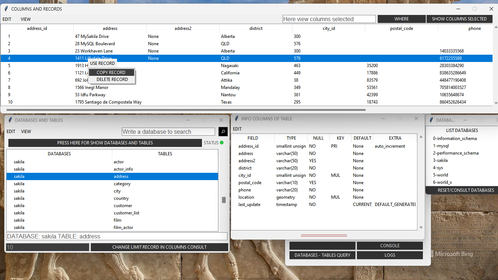

# Guidb MySQL

### Management a MySQL database with Python and Tkinter

 This interface contains some of the practical functionalities of a DBMS without the need to write everything completely in console with shorcuts menu.

#### Functions:

- Databases
    - Backup database
    - Create databases
    - Drop databases
    - Upload databases
    - Search database
    - View copy selected database with table
    - View all databases
- Tables
    - Create table
    - Drop table
    - View all tables inside database
- Columns
    - Alter columns
    - View specific columns of table
    - View copy column selected
    - View columns selected of table
    - Where options
- Records
    - Delete record or row selected
    - Insert any number of records
    - Truncate
    